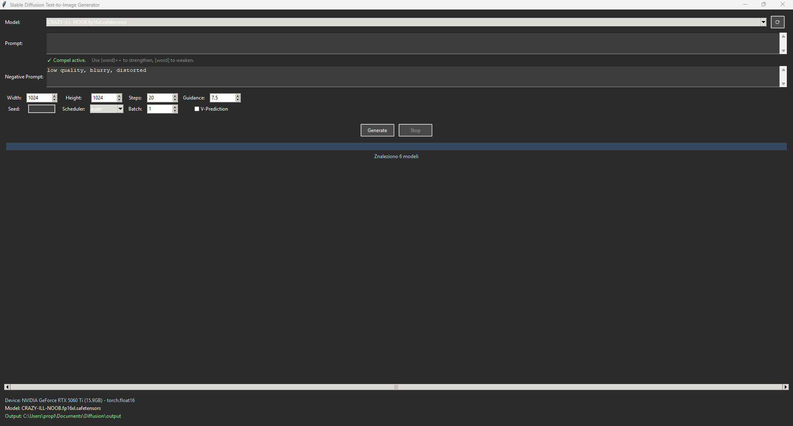

# AI Image Generation GUI

Main Window

A lightweight Windows GUI for AI image generation with batch support, 1.5× upscaling, and variety control. Coded with Google Gemini 2.5 Pro.

## Features
- Batch image generation
- Upscaling (1.5×)
- Variety control (Strength:0.55)
- Filename-based model autodetection (SDXL, v-pred)
- Simple one-click start scripts for Windows

## Requirements
- Windows 10 or Windows 11 (64-bit). 32-bit systems are not supported.
- NVIDIA GPU with CUDA support (CUDA 12.8 or newer). Recommended: NVIDIA RTX 20-series or newer.
- Python 3.12 (tested with 3.12.10) — https://www.python.org/downloads/release/python-31210/
- Git for Windows — https://git-scm.com/downloads/win

## Quick start
1. Install Git for Windows.
2. Install Python 3.12. When installing, check the "Add Python to PATH" option. A user-level install is fine — admin privileges are not required.
3. Clone this repository:
   git clone https://github.com/ProgramatorPL/Diffusion.git
4. Run `Install Requirements.bat` and wait for the setup to complete.
5. Run `Launch.bat` to start the GUI.
6. Enter your prompt, adjust settings, and click Generate.

## Model filename conventions
- To enable SDXL models, include `xl` or `sdxl` in the model filename (for example: my-model.sdxl.safetensors).
- To enable v-prediction models, include `vp`, `v-pred`, or a similar tag in the model filename (for example: my-model-vp.safetensors).
- You can combine tags in one filename (e.g., `my-sdxl-vp.ckpt`).
- The GUI also provides a checkbox to manually enable v-prediction.

## Output and metadata
- Generated images include metadata that Civitai and other services can read; however, some services may not detect the model name automatically. Keep this in mind when uploading.

## Troubleshooting
- Python packages fail to install: ensure Python 3.12 is installed and available in PATH. Try `python --version`.
- GPU acceleration not available: verify NVIDIA drivers and CUDA toolkit compatibility (CUDA 12.8+).
- Permission errors during installation: the provided bat scripts are intended to run without admin rights — run them in a normal user shell if possible.
- If models are not recognized: confirm your model filename follows the conventions above and that model files are placed in the expected models directory.

## Recommended workflow tips
- Use negative prompts to filter unwanted artifacts (for example: "low quality, blurry, distorted").
- Start with lower steps and increase gradually to balance speed and image quality.
- Use variety control to produce different outputs from the same prompt.

## Contributing
Contributions, bug reports and feature requests are welcome. Please open an issue with reproduction steps or submit a pull request with a clear description of the change.

## License
This project is open source under the MIT License. See the LICENSE file for details.
